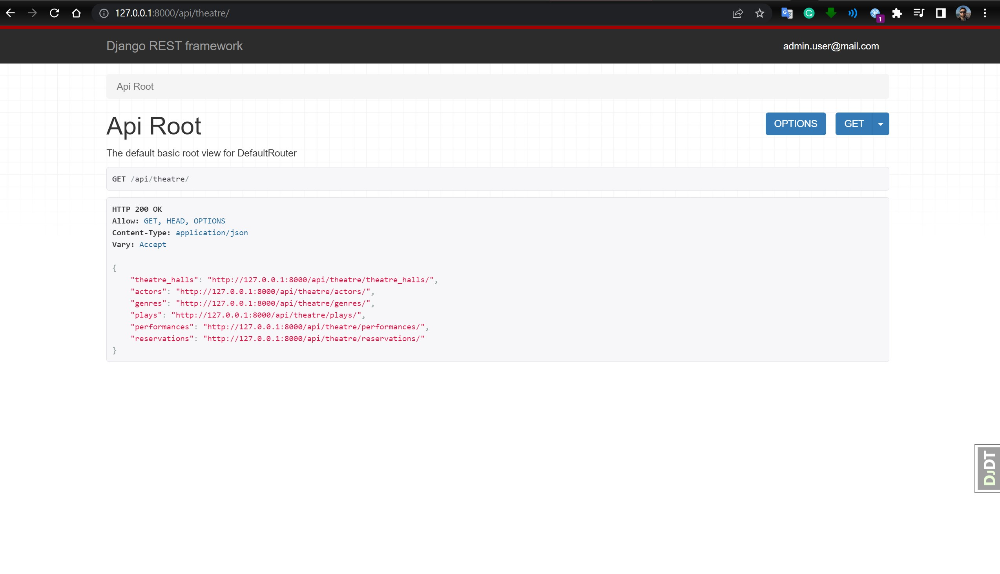
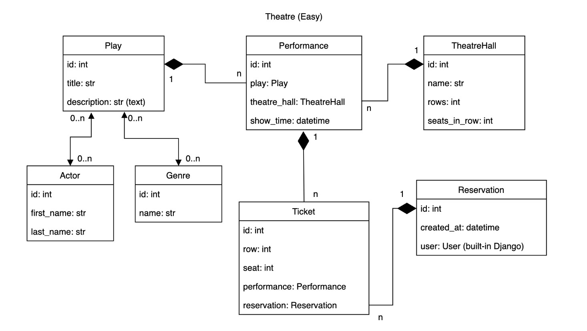

# Theatre API Service 

Project of API, that allows visitors of the theatre to make reservations online and choose needed seats without going physically to the theatre. Written of DRF.


## Installation

Python3 must be already installed

```shell
git clone https://github.com/ochernous/theatre-api-service
python -m venv venv
venv\Scripts\activate (on Windows)
source venv/bin/activate (on macOS)
pip install -r requirements.txt
python manage.py migrate
python manage.py runserver
```
Use the following command to load prepared data from fixture:
```shell
python manage.py loaddata theatre_api_service_db_data.json
```
After loading data from fixture you can use following superuser (or create another one by yourself):

- Login:```admin.user@mail.com```

- Password:```12password34```

### For creating new account follow these endpoints:
- Create user - /api/user/register
- Get access token - /api/user/token

You can load ModHeader extension for your browser and add request header (JWT). Example:

- key: Authorization

- value: Bearer ioaADF3fsosERWERdfsdi4389ad


## Features
- JWT authenticated
- Admin panel /admin/
- Documentation is located at /api/doc/swagger/
- Managing reservations ant tickets
- Creating plays with genres and actors
- Creating theatre halls
- Adding performances
- Filtering plays and performances



